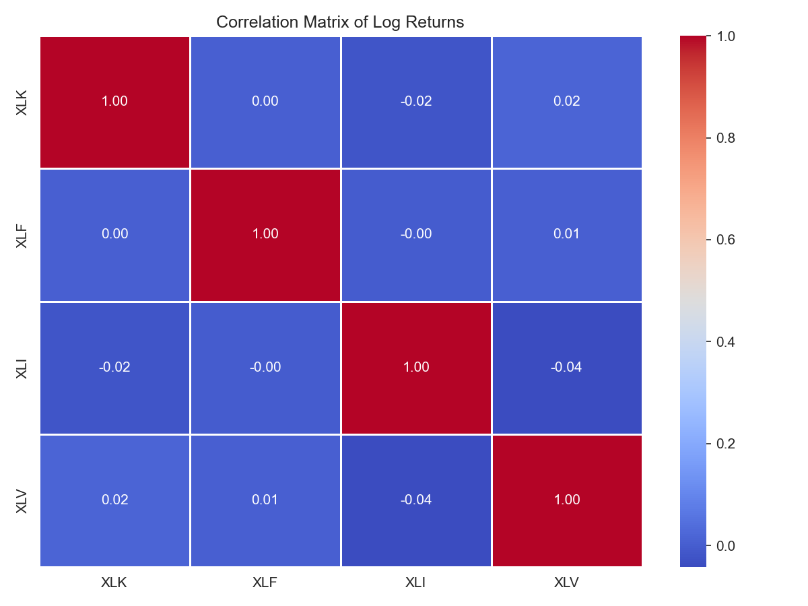
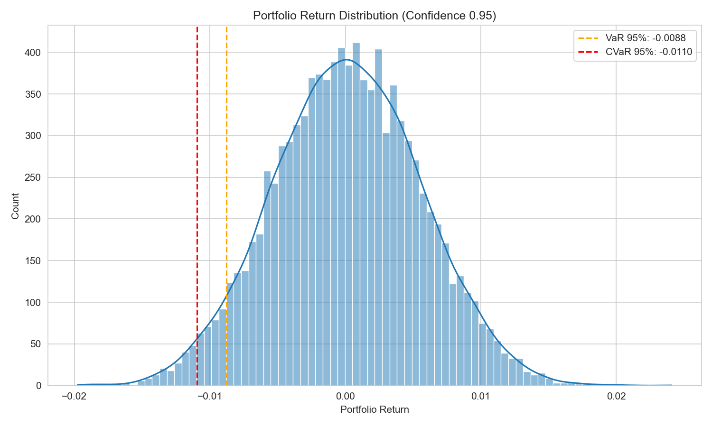

# Copula-Based Portfolio Risk Modeling
====================================

This project implements a complete workflow for **quantifying portfolio tail-risk** using
**Student-t marginal distributions** and a **Gaussian copula dependence structure**.
The goal is to move beyond simple correlation analysis and model **realistic joint behavior**
of asset returns, especially in stressed markets where traditional assumptions break down.

The pipeline takes price data for a small equity sector portfolio (XLK, XLF, XLI, XLV),
fits heavy-tailed distributions to individual returns, and estimates cross-asset dependence
through a Gaussian copula. Using Monte-Carlo simulation, it generates synthetic return paths
that preserve both **fat-tailed marginal behavior** and **inter-asset correlations**, allowing
robust estimation of **Value-at-Risk (VaR)** and **Conditional VaR (CVaR)**.

All results – including fitted parameters, copula correlation matrix, and risk summaries –
are saved under `data/processed/`, and visual outputs are saved to `figures/`.
If external price data cannot be downloaded, the project supports a fully offline mode
by generating **synthetic ETF price paths** that follow realistic geometric Brownian motion.

This repository is designed as a **reusable modular package** (`quantcopula/`)
that can serve as a practical template for academic coursework, quantitative research,
or portfolio-risk prototyping.


The pipeline is designed to run **even without internet access** through synthetic price data generation.

---

## Features

| Component | Description |
|----------|------------|
| **Synthetic or real data support** | Download from Yahoo Finance **or** bootstrap locally |
| **Student-t marginals** | Models fat-tailed return distributions |
| **Gaussian copula modeling** | Captures cross-asset dependence structure |
| **Monte-Carlo simulation** | Generates synthetic portfolio returns with realistic dependencies |
| **Risk metrics** | Computes left-tail **VaR** and **CVaR** |
| **Visualizations** | ECDF, histogram, heatmap, price & returns plots |
| **Modular package** | Extendable architecture in `quantcopula/` |

---


## Project Structure

```text
quant-copula-risk/
├─ data/
│  ├─ raw/          # cached or synthetic prices (parquet)
│  └─ processed/    # t-params, copula correlation, risk summary
│
├─ notebooks/
│  ├─ data/
│  └─ figures/
│
├─ quantcopula/
│  ├─ __init__.py
│  ├─ data.py
│  ├─ margins.py
│  ├─ copula.py
│  ├─ plotting.py
│  └─ risk.py
│
└─ scripts/
   ├─ bootstrap_synthetic_data.py   # generate synthetic prices (offline mode)
   └─ run_pipeline.py               # main workflow

```
---

## Installation

```bash
git clone <your-github-url>.git
cd quant-copula-risk

python -m venv .venv
# Windows:
.venv\Scripts\activate
# macOS/Linux:
source .venv/bin/activate

pip install -r requirements.txt
```

## Running the Pipeline
-  Option A — Real market data (if internet works)
python scripts/run_pipeline.py

##  Option B — Offline mode (recommended)
python scripts/bootstrap_synthetic_data.py
python scripts/run_pipeline.py

This creates the synthetic dataset:
data/raw/prices_XLK,XLF,XLI,XLV_2013-01-01_2023-12-31_close.parquet

## Outputs
| Location          | Contents                                                               |
| ----------------- | ---------------------------------------------------------------------- |
| `data/processed/` | `t_params.parquet`, `gaussian_copula_corr.parquet`, `risk_summary.csv` |
| `figures/`        | Visualizations: prices, returns, heatmap, VaR/CVaR                     |

Example console output:
VaR 95%: -0.0088, CVaR 95%: -0.0110

=== Risk comparison (portfolio level) ===
     model  alpha       VaR      CVaR
historical   0.95 -0.008909 -0.011180
    copula   0.95 -0.008784 -0.010951

## Methodology Overview

### 1. Data sourcing
- Retrieve market prices (or generate synthetic data)
- Persist dataset locally (`data/raw/`) as Parquet

### 2. Marginal modeling
- Compute daily log returns
- Fit Student-t marginal distribution for each asset
- Apply Probability Integral Transform (PIT) to produce Uniform(0,1) samples

### 3. Dependence modeling
- Transform uniforms to Gaussian space
- Estimate empirical correlation matrix
- Fit **Gaussian copula** to capture cross-asset dependence
- Monte-Carlo simulate new samples from the copula

### 4. Inverse transformation
- Map simulated uniforms back to the return space via the fitted Student-t CDF inverse

### 5. Portfolio tail-risk
- Construct equal-weight portfolio
- Compute **VaR** and **CVaR** from simulated distributions


## Example Outputs

### Correlation Heatmap


### Portfolio Distribution with VaR & CVaR


### Additional Figures
- [prices.png](figures/prices.png)
- [returns.png](figures/returns.png)
- [ecdf_hist.png](figures/ecdf_hist.png)
- [ecdf_copula.png](figures/ecdf_copula.png)


## Troubleshooting

| Problem                | Solution                                        |
| ---------------------- | ----------------------------------------------- |
| Yahoo download fails   | Run offline mode: `bootstrap_synthetic_data.py` |
| Missing parquet engine | `pip install pyarrow`                           |
| No figures saved       | Ensure pipeline writes to existing `figures/`   |
| VaR/CVaR = nan         | Check returns length > 1                        |

## License

MIT License — free for academic and commercial use.

## Author
**Zdravko Ovcharov**
MSc Business Analytics / Data Science